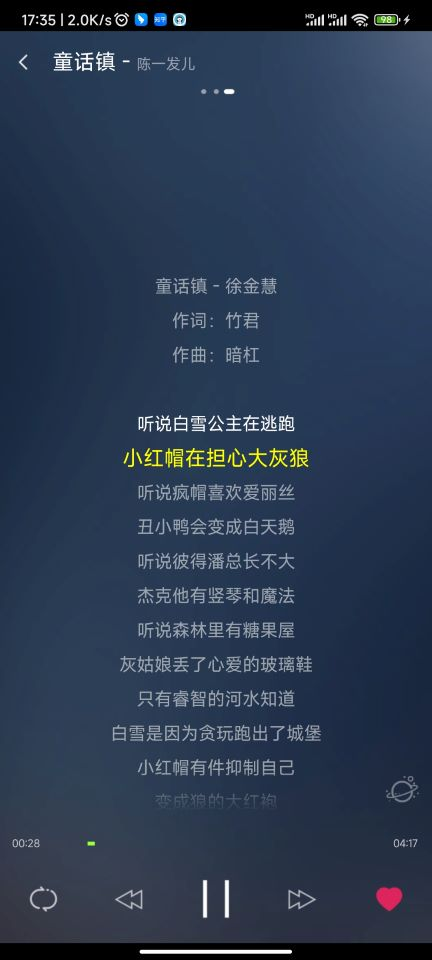

# ttpod
## TTPod 7.6.1 Rebuild
## 天天动听7.6.1版本重新编译。
### 可以使用最新Android Studio编译通过并运行。
- 1.已完成jadx伪代码转可运行代码。
- 2.部分resources资源重构。
- 3.可以本地扫描音乐并播放。
- 4.新增排行页数据展示（QQ音乐数据）
- 
- 5.新增实时歌词[`@22lrc`](http://www.22lrc.com/)
- 
### 待完善：
- 1.主题载入问题(已修复部分问题)。
- 2.大部分图标无法显示问题(已修复部分问题)。
- 3.多到数不清的BUG(现在少点了).
